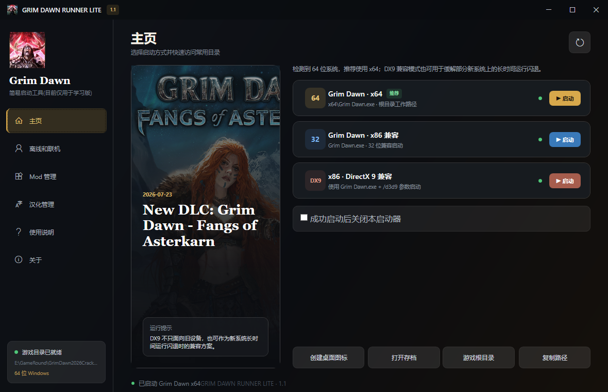

# Grim Dawn Runner Lite

一个面向《恐怖黎明》（Grim Dawn）玩家的轻量本地启动器。
为即将到来的恐怖黎明 1.3正式版做好准备~

  
  

这个项目主要用来简化游戏启动和一些常用管理操作，例如游戏目录设置、账号配置修改、汉化字体管理，以及字体包在线更新。

## 功能特性

- 自动识别或手动设置游戏目录
- 支持 x64 / x86 / DX9 启动方式
- 保存启动器基础设置
- 提供账号配置编辑功能
- 支持汉化字体包扫描、安装、删除
- 支持基于 GitHub 的字体包与汉化文本在线更新
- 支持国内加速、GitHub 官方线路和系统/自定义代理
- 字体与汉化文本显示适配的游戏版本标签
- 支持创建桌面快捷方式

## 运行环境

- Windows
- .NET 10
- 已安装《恐怖黎明》（Grim Dawn）

## 使用说明

1. 启动程序。
2. 首次使用时，按提示选择游戏目录。
3. 在主页选择需要的启动方式。
4. 按需使用账号、汉化字体和更新相关功能。
5. 如果需要，也可以直接创建桌面快捷方式。

## 仓库说明

这个仓库主要保存启动器本体源码。

部分辅助目录、构建产物或发布准备内容不会作为公开源码的一部分保留，例如：

- AI 工具相关目录
- `GitHubPackageTemplate/`
- `bin/`
- `upload/`

## 免责声明

- 本项目为非官方工具，与游戏官方无从属关系。
- 本项目主要面向普通玩家的日常使用场景，不是面向专业研究用途的工具说明文档。
- 使用前建议自行备份相关配置或文件。
